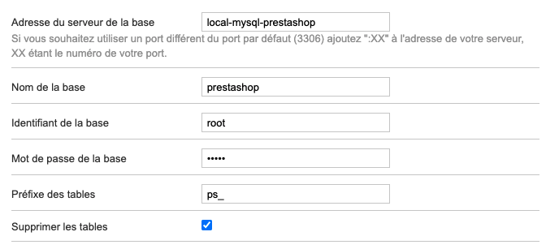

# Ps-shop

This repo allows you to launch locally a PrestaShop instance of a shop

## Requirement

* [Docker installed](https://www.docker.com/products/docker-desktop)

## Getting started

_If you need more information about this installation [visit the official documentation](https://hub.docker.com/r/prestashop/prestashop/)_

```bash
# Create network
$ docker network create prestashop-net

# Launch the service (if you do not have a Apple M1 chips)
docker-compose up -d
```

### Specific for Apple M1 chips

```bash
# Create network
$ docker network create prestashop-net

# Launch the service (if you do not have a Apple M1 chips)
docker-compose -f docker-compose.amd64.yml up -d
```

## Configure the shop

Visit http://localhost:8082.

When you arrive in the Database configuration you can use these values:

* Address: `local-mysql-prestashop`
* DB Name: `prestashop`
* Login: `root`
* Password: `admin`



